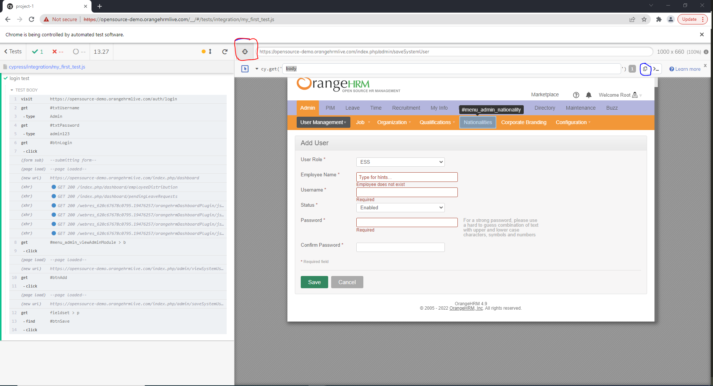

# Learning Cypress

### Cypress tutorial:
https://www.youtube.com/watch?v=CYcdT-tOvB0&list=PLhW3qG5bs-L9LTfxZ5LEBiM1WFfvX3dJo&index=1

## Cypress Prerequisites:

### Hardware:
* Window 7 and above
* macOS 10.9 and above (64-bit only)
* Linux Ubuntu 12.04 and above, Fedora 21 and Debian 8 (64-bit only)

### Software:
* Node.js 10 or 12 and above

### Set up project:
* Create a new project folder for Cypress project
* Open that folder in VS Code 
* Open VS Code terminal and run command: `npm init -y`
* Install Cypress: `npm install cypress`
* Check Cypress version and install it by using command: `npx cypress -v`
* Open Cypress: `npx cypress open`

### Coding instructions:
* Create a file in folder `cypress/integration`
* Take a look at those files in that folder
* Take a look at `cypress.json` to see the configuration. More configuration can be found here: https://docs.cypress.io/guides/references/configuration#cypress-json

#### Access elements:

* Red circle: use selector
* Hover to the component that you want to get 
* Blue circle: copy the element

#### Implicit vs Explicit Assertions;
https://javascript.plainenglish.io/types-of-cypress-assertions-405844a5c8cf
* Implicit assertions: `should()`, `and()`
* Explicit assertions: `expect()`, `assert()`

#### Steps to make a real test:
* visit a site: `cy.visit()`
* query for an element 
* trigger an element
* make an assertion

More information can be found here: https://docs.cypress.io/guides/getting-started/writing-your-first-test#Write-a-real-test

#### Common Assertion Commands: https://example.cypress.io/commands/assertions
`should`: https://docs.cypress.io/api/commands/should
* `contains`: check if element contains a specific text 
* `have`: check if element have a specific component or not. For example: have.class --> check if element have a class with name or not
--> other function `have.class`, `have.text`, `have.html`
* `be`: check status of an element. For example: with a radio button, check if it has been selected or not
--> other function `be.visible`, `be.selected`, `be.disabled`, `be.focused`
* `equal`: check value of an element using `invoke` to get the attribute based on element type (class or id)
* `and`: chained assertions --> do multiple assertions at the same time

`expect`
* `expect(Something).to.be.true`: expect a condition to be true

--> other function: `to.not.equal()`, `to.be.a('string')`, `to.be.true`, `to.be.false`, `to.be.null`, `to.exist`

* `assert`--> `equal` or `strictEqual`

--> other function: `isAbove`, `isBelow`, `exists`, `notExists`,`true`, `false`, `isString`, `isNotString`

#### Page Object Model: 
Check out file `login_test.js` 

#### Show reports after doing test cases:
* Install `npm install mochawesome --save-dev`
* Install `npm install mochawesome-merge --save-dev`
* Install `npm install rimraf`
* Add configuration in `cypress.json`: 
```
"reporter": "mochawesome",
    "reporterOptions":{
        "charts":true,
        "overwrite":false,
        "html":false,
        "json":true,
        "reportDir":"cypress/reports"
    }
```
The reportDir can be any folder directory as you want
* Take a look at the `package.json` file where:

```
"pretest": "rimraf -r ./cypress/reports/*.json"
``` 
is to remove `json` files in folder `cypress/reports`
```
"test": "npm run cypress-test || npm run posttest",
"cypress-test": "cypress run",
```
is to run cypress test cases. While `posttest` is to create reports

```
"posttest": "npm run merge-reports && npm run generate-htmlreport",
"merge-reports": "mochawesome-merge cypress/reports/*.json > cypress/reports/output.json",
"generate-htmlreport": "marge cypress/reports/output.json --reportDir cypress/reports"
```
`merge-reports` is to merge multiple `json` files into one file. The file after `>` is the output file

`generate-htmlreport` is to create reports, videos after using the output json file

Running these commands by `npm run pretest` or `npm run test` 